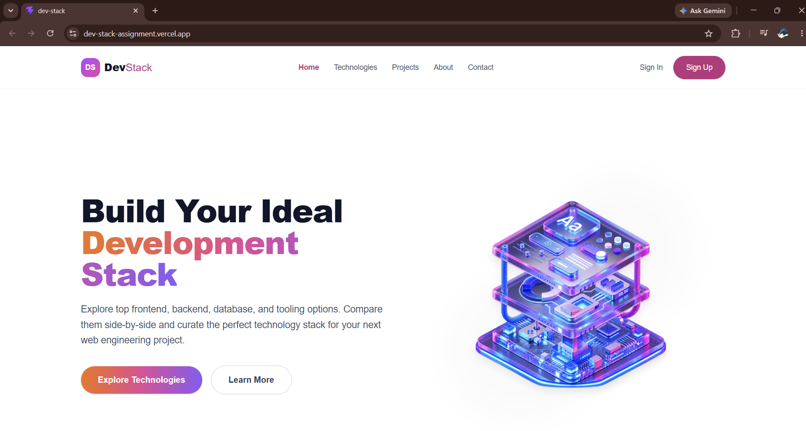

# Dev Stack Builder 🚀

<!-- Add your screenshot below -->

## 📖 Description
Dev Stack Builder is a responsive, interactive web application that allows developers to browse a curated catalog of programming languages, frameworks, and tools to build their ideal custom development stack. It features real-time state management, duplicate prevention, and a dynamic sticky sidebar.

## 🔗 Live Demo
- **Live Site Link:** https://dev-stack-assignment.vercel.app/

## ✨ Top 3 Features
1. **Interactive Stack Builder:** Users can dynamically add or remove technologies from their personal stack with real-time UI updates and disabled button states.
2. **Duplicate Prevention & Alerts:** The app intelligently prevents users from adding the same technology twice, providing immediate feedback via Toastify notifications.
3. **Responsive Sticky Layout:** Features a modern CSS Grid layout where the "Your Stack" sidebar smoothly sticks to the screen while scrolling on desktop, and stacks neatly on mobile.

## 🛠️ Technologies Used
- **React (with TypeScript)** - Core UI framework
- **Vite** - Build tool and development server
- **Tailwind CSS v4** - Utility-first styling
- **React Toastify** - Interactive alert notifications
- **React Icons** - Clean UI icons
- **Local JSON** - Data fetching simulation

---

## 🧠 React Theory Questions

**1. What is JSX, and why is it used in React?**
- JSX is almost like HTML but we write it inside our JavaScript file. We use it in React because it makes it very easy to build the UI and write logic in the same place without making things complicated.

**2. What is the difference between props and state?**
- Props are used to send data from a parent component to a child component, and the child can't change them. State is like a component's own memory. We can update the state, and when we do, the screen updates.

**3. What does the useState hook do, and where did you use it in this project?**
- `useState` helps a component remember data when things change. In this project, i used it in App.tsx to save the technologies array, the loading state, and the stack array so i can keep track of what is selected.

**4. What does the useEffect hook do, and why did you need it to load the JSON data?**
- `useEffect` is used to do side tasks like fetching data when a component loads. I used it to fetch my data.json file so the data only loads exactly once when the website opens.

**5. Why does every item in a .map() list need a unique key prop?**
- When we use .map() to show a list, React needs a unique key for every item. It helps React know exactly which item is added, changed, or removed without having to update the whole list every time.

**6. What is conditional rendering? Show one place you used it.**
- Conditional rendering means showing different things on the UI based on a condition, kind of like an if/else statement. I used it in the Sidebar. If the stack is empty, it shows the "Your stack is empty" box, otherwise it shows the list of selected tech cards.

**7. How do you pass data from a parent component to a child component, and how does a child send something back to the parent?**
- We pass data from a parent to a child by sending it through props. If a child needs to send something back to the parent, the parent passes down a function as a prop, and the child just calls that function. I did this when I passed the `handleAddToStack` function to the TechCard so it could update the App's state.
